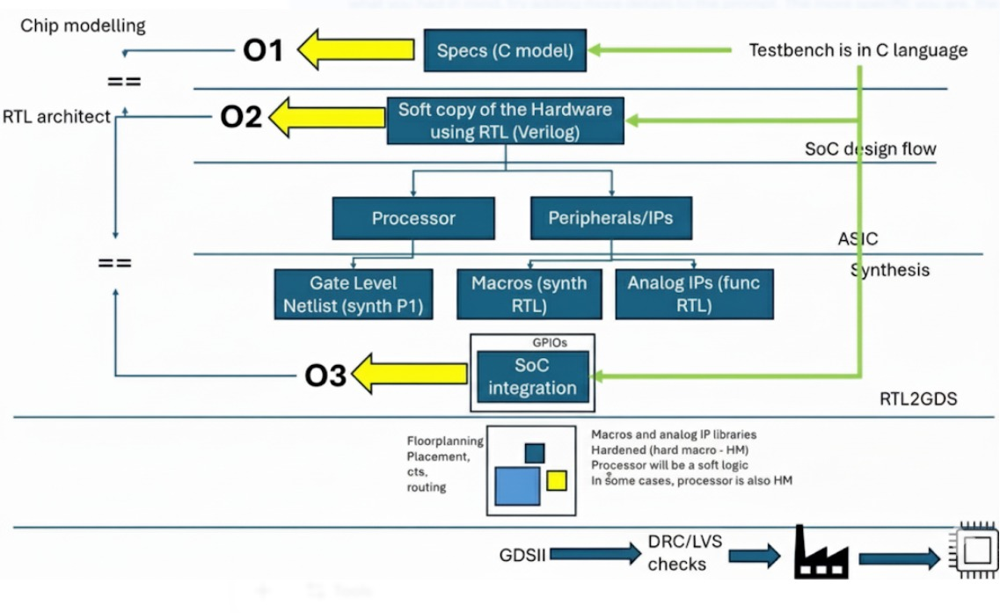

## **TASK 1 - Summary of Digital VLSI SOC Design and Planning**

## 1. Chip Modeling – O1

- Starts with **C-based specifications** for modeling chip functionality.
- A **C Model** acts as a functional simulator of the chip's behavior.
- **Testbenches** are written in C to verify the correctness of the model.

## 2. RTL Architecture – O2

- C model is translated into **Register Transfer Level (RTL)** using **Verilog** or **VHDL**.
- RTL is a **soft copy of hardware**, capturing design logic and timing.

### RTL Components
- **Processor Core** (e.g., RISC-V, ARM)
- **Peripherals / IPs** (e.g., UART, SPI)

###  Synthesis Results
- **Gate-Level Netlist** – Logic-level representation of processor and other logic blocks.
- **Macros (Synthesized RTL)** – Reusable blocks synthesized from RTL.
- **Analog IPs (Functional RTL)** – Modeled in RTL for mixed-signal parts like PLLs, ADCs.

## 3. SoC Integration – O3

- Integrates all components into a **single SoC design**:
  - Processor
  - Peripherals
  - Analog IPs
  - GPIOs and Interconnects

- Performs **integration verification** to ensure RTL matches the C model’s intended behavior.

## 4. Physical Design Flow (RTL → GDSII)

This phase converts the RTL into a physical chip layout.

### Key Steps
- **Floorplanning** – Define layout of major blocks.
- **Placement & Routing** – Physically connect the blocks.
- **Clock Tree Synthesis (CTS)** – Distribute clock signals.

### Final Checks
- **DRC (Design Rule Check):** Ensures layout follows fabrication rules.
- **LVS (Layout vs Schematic):** Ensures layout matches logical design.

- **GDSII File** is generated for fabrication.

**Hard Macros (HM):** Fixed, pre-placed IPs (e.g., memory, analog)  
**Soft Macros:** Synthesizable RTL blocks (flexible)

##  Key Concepts

| Term          | Description |
|---------------|-------------|
| **Soft Macro** | Synthesizable RTL; flexible and modifiable |
| **Hard Macro** | Pre-designed layout; optimized and fixed |
| **GDSII**      | Final chip layout file used for fabrication |
| **DRC**        | Design Rule Check for manufacturing compliance |
| **LVS**        | Layout vs Schematic check for functional match |

## Summary:

This flow ensures a smooth transition from a high-level idea to a real silicon chip

